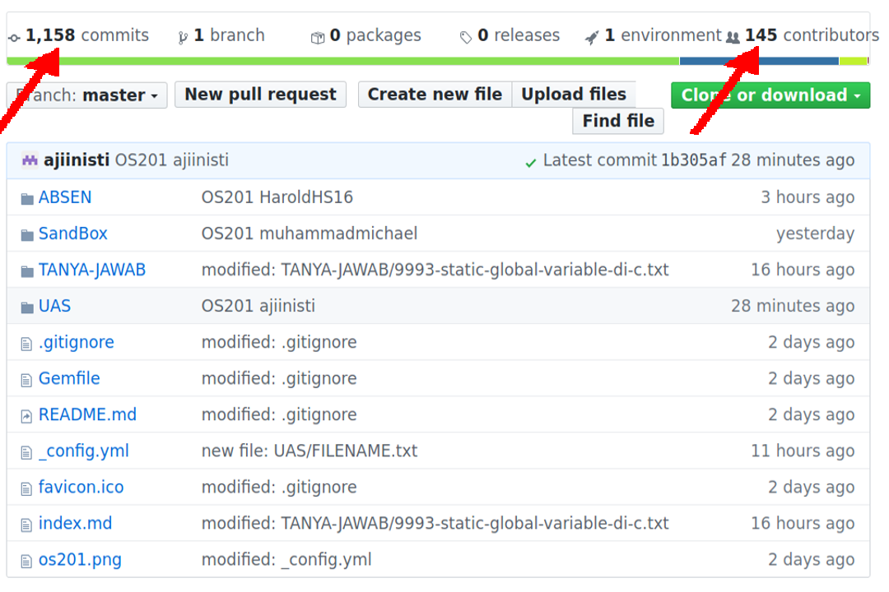

---
---
# Welcome to Operating Systems 2020 - 1 (os201)

* [GitHub](https://github.com/UI-FASILKOM-OS/os201)
* [GitHub Pages](https://ui-fasilkom-os.github.io/os201/)

## [TANYA JAWAB dan PENGUMUMAN](https://github.com/UI-FASILKOM-OS/os201/tree/master/TANYA-JAWAB)

* [9995-Jika-sudah-absen-tanpa-commit](TANYA-JAWAB/9995-Jika-sudah-absen-tanpa-commit-OS201AkunGitHub-harus-absen-ulang.txt)
* [9996-LOG-COMMIT.txt](TANYA-JAWAB/9996-LOG-COMMIT.txt)
* [9997-HARAP-ABSEN.txt](TANYA-JAWAB/9997-HARAP-ABSEN.txt)
* [9998-PENGUMUMAN-PERTAMA.txt](TANYA-JAWAB/9998-PENGUMUMAN-PERTAMA.txt)
* [9999-PERTAMAX.txt](TANYA-JAWAB/9999-PERTAMAX.txt)

 

 
Harap segera mendaftar ke proyek GitHub ini (bagi yang belum).

Jolan Tru!

